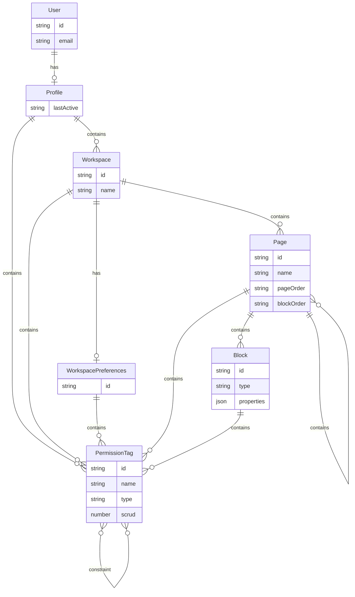
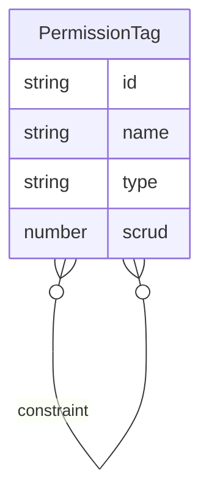

```mermaid
erDiagram

User {
	string id
	string email
}

Profile {
	string lastActive
}

PermissionTag {
  string id
  string name
  string type
  number scrud
}

Workspace {
  string id
  string name
}

WorkspacePreferences {
  string id
}

Page {
  string id
  string name
  string pageOrder
  string blockOrder
}

Block {
  string id
  string type
  json properties
}

User ||--o| Profile: has
Profile ||--o{ Workspace : contains
Profile ||--o{ PermissionTag : contains
Workspace ||--o{ PermissionTag : contains
Workspace ||--o{ Page : contains
Workspace ||--o| WorkspacePreferences: has
WorkspacePreferences ||--o{ PermissionTag : contains
Page ||--o{ Block : contains
Page ||--o{ Page : contains
Page ||--o{ PermissionTag : contains
Block ||--o{ PermissionTag : contains
PermissionTag }o--o{ PermissionTag: constraint
```

```mermaid
erDiagram

PermissionTag {
  string id
  string name
  string type
  number scrud
}

PermissionTag }o--o{ PermissionTag: constraint
```
